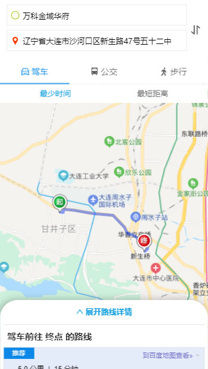
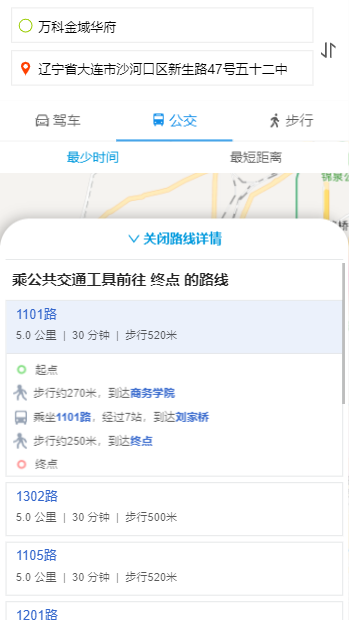
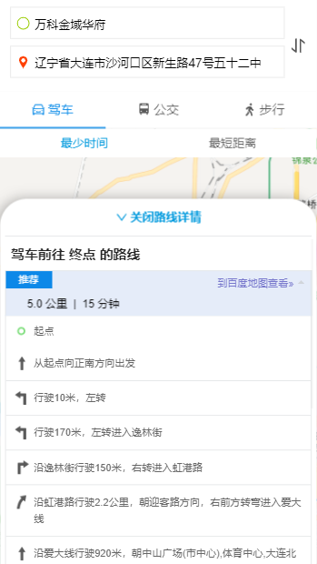

# path-planning

> 基于百度地图2.0 、 react 、antd-mobile 实现的路线规划组件

## 功能简介

-   <i style="color:green">√</i> 开箱即用、只需简单配置
-   <i style="color:green">√</i> 高端简洁
-   <i style="color:green">√</i> 支持驾车路线、公交路线、步行路线规划
-   <i style="color:green">√</i> 传入默认起点终点后依然支持用户自定义输入地址
 
> 喜欢的话给我一颗星吧！

## 在线体验[codesandbox]

-   
<a href="https://codesandbox.io/s/path-planning-2wid5">点击直达</a>
 
## 预览图

 
 
## 所需安装依赖
    "dependencies": { 
        "antd-mobile": "2.3.3",   
        "react": "16.12.0", 
        "react-dom": "16.12.0", 
        "@ant-design/icons": "4.2.2",
    }

## <a id="use">下载&引用</a>

    yarn add path-planning | npm i path-planning

    import PathPlanning from 'path-planning'

## 说明：
        引用组件前应在页面引入百度地图cdn
        

## <a id="example">使用实例</a>

    //需要注意使用该组件，页面必须是将组件置于单独的一个页面，页面高度需要为窗口高
    //也就是说改组件必须单独占一个路由地址 组件属性可以通过路由地址从其他页面传入在传到路线规划组件...
    export default ()=>{
        return 

            <PathPlanning 
                //属性必须设置
                city={"大连"}
                startAddress={"七贤岭"}
                endAddress={"五十二中"}
            />
        

    }